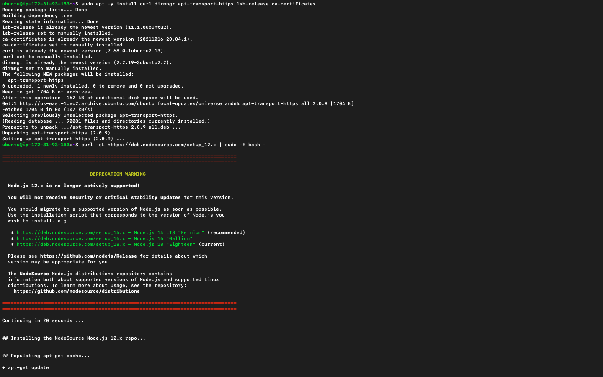
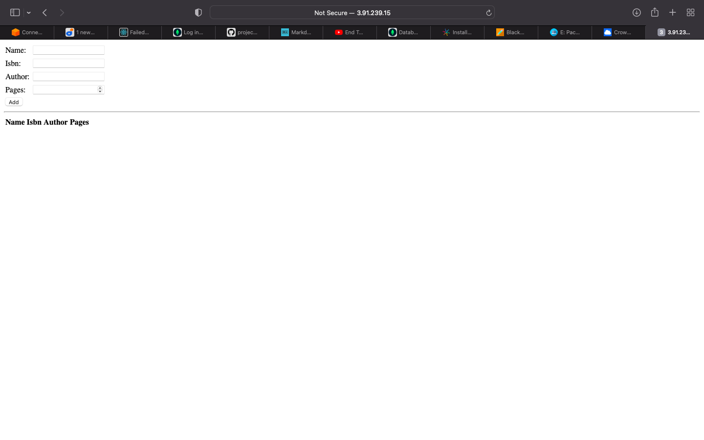

# MEAN STACK DEPLOYMENT TO UBUNTU IN AWS
MEAN Stack is a combination of following components:
MongoDB (Document database) – Stores and allows to retrieve data.
Express (Back-end application framework) – Makes requests to Database for Reads and Writes.
Angular (Front-end application framework) – Handles Client and Server Requests
Node.js (JavaScript runtime environment) – Accepts requests and displays results to end user

## STEP 0
Creating EC2 instance

## STEP1: Installing NodeJs
Commands:

Update ubuntu
`sudo apt update`

Upgrade ubuntu
`sudo apt upgrade`

Adding certificates
`sudo apt -y install curl dirmngr apt-transport-https lsb-release ca-certificates'
'curl -sL https://deb.nodesource.com/setup_12.x | sudo -E bash -`

Installing NodeJS
`sudo apt install -y nodejs`

## Step 2: Installing MongoDB
Commands:
`sudo apt-key adv --keyserver hkp://keyserver.ubuntu.com:80 --recv 0C49F3730359A14518585931BC711F9BA15703C6`
`echo "deb [ arch=amd64 ] https://repo.mongodb.org/apt/ubuntu trusty/mongodb-org/3.4 multiverse" | sudo tee /etc/apt/sources.list.d/mongodb-org-3.4.list`
`sudo apt install -y mongodb`

Starting The server
`sudo service mongodb start`

Verify that the service is up and running
`sudo systemctl status mongodb`

Installing npm – Node package manager.
`sudo apt install -y npm`

Installing body-parser package
`sudo npm install body-parser`

Creating a folder named ‘Books’
`mkdir Books && cd Books`

In the Books directory, Initializing npm project
`npm init`

Adding a file to it named server.js
'vi server.js'

Copy and paste the web server code below into the 'server.js file'

var express = require('express');
var bodyParser = require('body-parser');
var app = express();
app.use(express.static(__dirname + '/public'));
app.use(bodyParser.json());
require('./apps/routes')(app);
app.set('port', 3300);
app.listen(app.get('port'), function() {
    console.log('Server up: http://localhost:' + app.get('port'));
});
---

## INSTALL EXPRESS AND SET UP ROUTES TO THE SERVER
sudo npm install express mongoose
In ‘Books’ folder, create a folder named apps

`mkdir apps && cd apps`
Create a file named routes.js

`vi routes.js`
Copy and paste the code below into routes.js
---
var Book = require('./models/book');
module.exports = function(app) {
  app.get('/book', function(req, res) {
    Book.find({}, function(err, result) {
      if ( err ) throw err;
      res.json(result);
    });
  }); 
  app.post('/book', function(req, res) {
    var book = new Book( {
      name:req.body.name,
      isbn:req.body.isbn,
      author:req.body.author,
      pages:req.body.pages
    });
    book.save(function(err, result) {
      if ( err ) throw err;
      res.json( {
        message:"Successfully added book",
        book:result
      });
    });
  });
  app.delete("/book/:isbn", function(req, res) {
    Book.findOneAndRemove(req.query, function(err, result) {
      if ( err ) throw err;
      res.json( {
        message: "Successfully deleted the book",
        book: result
      });
    });
  });
  var path = require('path');
  app.get('*', function(req, res) {
    res.sendfile(path.join(__dirname + '/public', 'index.html'));
  });
};
---
In the ‘apps’ folder, create a folder named models

`mkdir models && cd models`
Create a file named book.js

`vi book.js`
Copy and paste the code below into ‘book.js’
---
var mongoose = require('mongoose');
var dbHost = 'mongodb://localhost:27017/test';
mongoose.connect(dbHost);
mongoose.connection;
mongoose.set('debug', true);
var bookSchema = mongoose.Schema( {
  name: String,
  isbn: {type: String, index: true},
  author: String,
  pages: Number
});
var Book = mongoose.model('Book', bookSchema);
module.exports = mongoose.model('Book', bookSchema);
---
## Access the routes with AngularJS
Changing the directory back to ‘Books’

Creating a folder named public
`mkdir public && cd public`

Adding a file named script.js
`vi script.js`
Copy and paste the Code below (controller configuration defined) into the script.js file.
---
var app = angular.module('myApp', []);
app.controller('myCtrl', function($scope, $http) {
  $http( {
    method: 'GET',
    url: '/book'
  }).then(function successCallback(response) {
    $scope.books = response.data;
  }, function errorCallback(response) {
    console.log('Error: ' + response);
  });
  $scope.del_book = function(book) {
    $http( {
      method: 'DELETE',
      url: '/book/:isbn',
      params: {'isbn': book.isbn}
    }).then(function successCallback(response) {
      console.log(response);
    }, function errorCallback(response) {
      console.log('Error: ' + response);
    });
  };
  $scope.add_book = function() {
    var body = '{ "name": "' + $scope.Name + 
    '", "isbn": "' + $scope.Isbn +
    '", "author": "' + $scope.Author + 
    '", "pages": "' + $scope.Pages + '" }';
    $http({
      method: 'POST',
      url: '/book',
      data: body
    }).then(function successCallback(response) {
      console.log(response);
    }, function errorCallback(response) {
      console.log('Error: ' + response);
    });
  };
});
---
In public folder, create a file named index.html;

`vi index.html`
Cpoy and paste the code below into index.html file.
---
<!doctype html>
<html ng-app="myApp" ng-controller="myCtrl">
  <head>
    
    
  </head>
  <body>
    

      <table>
        <tr>
          <td>Name:</td>
          <td><input type="text" ng-model="Name"></td>
        </tr>
        <tr>
          <td>Isbn:</td>
          <td><input type="text" ng-model="Isbn"></td>
        </tr>
        <tr>
          <td>Author:</td>
          <td><input type="text" ng-model="Author"></td>
        </tr>
        <tr>
          <td>Pages:</td>
          <td><input type="number" ng-model="Pages"></td>
        </tr>
      </table>
      <button ng-click="add_book()">Add</button>
    

    

    

      <table>
        <tr>
          <th>Name</th>
          <th>Isbn</th>
          <th>Author</th>
          <th>Pages</th>

        </tr>
        <tr ng-repeat="book in books">
          <td>{{book.name}}</td>
          <td>{{book.isbn}}</td>
          <td>{{book.author}}</td>
          <td>{{book.pages}}</td>

          <td><input type="button" value="Delete" data-ng-click="del_book(book)"></td>
        </tr>
      </table>
    

  </body>
</html>
---

Change the directory back up to Books

cd ..
Starting the server by running this command:

`node server.js`
The server is now up and running, we can connect it via port 3300. You can launch a separate Putty or SSH console to test what curl command returns locally.

`curl -s http://localhost:3300`
It shall return an HTML page, it is hardly readable in the CLI, but we can also try and access it from the Internet.

For this – I  openED TCP port 3300 in AWS Web Console for your EC2 Instance.
